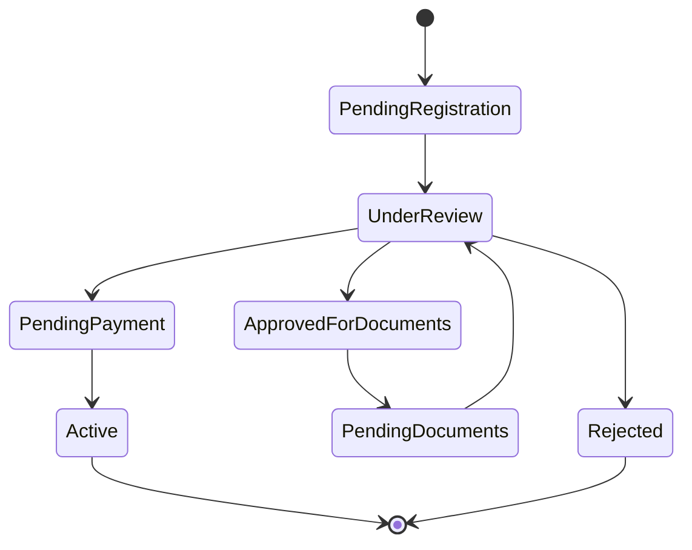
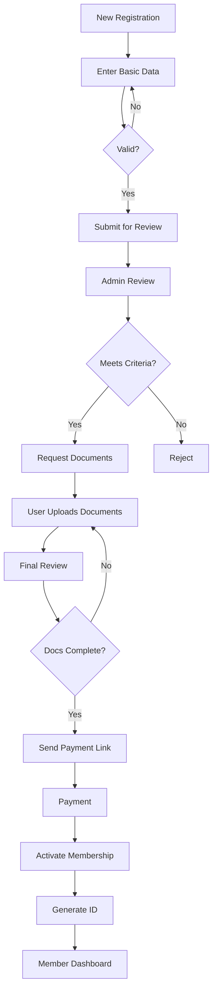
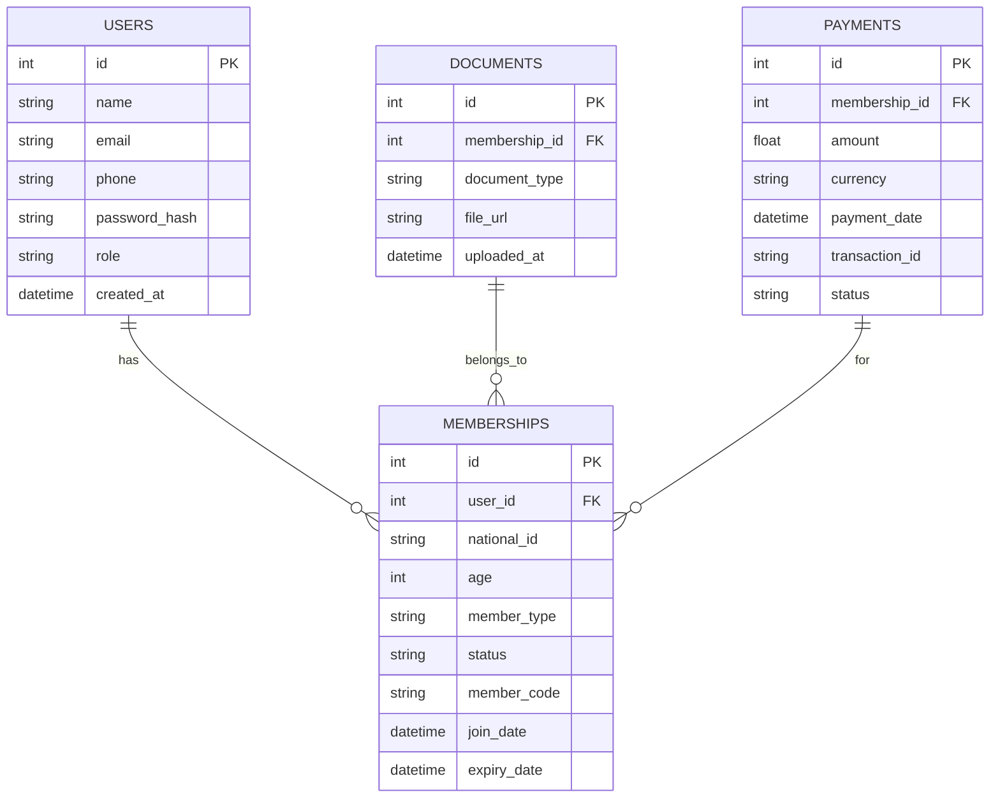

# Membership Management System

## Project Requirements

### Overview
A comprehensive solution for managing the entire membership lifecycle—from registration to final activation—with advanced administrative tools for managers.

### System Requirements

#### Membership Lifecycle

**State 1: Initial Registration**
- New registration page: Full name, National ID, contact info (email, phone), age, membership type (Engineering Professional/Student).
- Data validation before submission.
- Submit request for admin review.

**State 2: Administrative Review**
- Admin interface to view new requests.
- Actions:
  - Preliminary approval (send to user for document completion).
  - Rejection (with reason).

**State 3: Document Completion**
- User notification to upload required documents.
- Re-submit for final review.

**State 4: Final Approval & Payment**
- Status changed to "Pending Payment".
- Send payment link via email.
- Integration with payment gateway (e.g., Stripe/PayPal).

**State 5: Final Activation**
- Automatic activation upon payment confirmation.
- Generate unique membership ID.
- Send confirmation email with membership details.

#### Member Dashboard
- View personal information.
- Membership status (Active/Expired/Pending).
- Unique membership ID.
- Join date and membership duration.
- Update personal info.

#### Admin Dashboard
- Advanced Search:
  - Membership ID, name, membership type, status.
- Requests Management:
  - Filter requests by stage (New/Pending Documents/Awaiting Payment).
  - View full request details.
  - Manually update request status.
- Reports:
  - Membership statistics (Active/Expired/Pending).
  - Financial payment reports.
  - Export data to CSV.

#### User Management & Roles
- Three permission levels:

| Role       | Permissions                             |
|------------|-----------------------------------------|
| Member     | Access member dashboard only.           |
| Supervisor | Manage requests, generate reports.      |
| Admin      | Full permissions (user management, system settings, audit logs). |

- Secure authentication (JWT/OAuth2).
- Audit logs for role changes and critical actions.

### Additional Requirements
- WordPress integration via REST API.
- Notifications (email/in-app).
- Audit logs for all operations.
- Automated database backups.
- Rate limiting for API endpoints.

### Diagrams (Mermaid Syntax)

#### 1. Membership State Diagram



#### 2. Process Flowchart



#### 3. ER Diagram



### Technical Structure

#### 1. Infrastructure
- Frontend: React.js (Redux Toolkit)
- Backend: Node.js/Express.js
- Database: MySQL (AWS RDS)
- Hosting: AWS EC2 + S3
- Payment: Stripe/PayPal API
- WordPress: Custom REST API endpoints.

#### 2. File Structure

```text
├── client/  
│   ├── public/  
│   └── src/  
│       ├── components/  
│       ├── pages/  
│       │   ├── MemberDashboard.js  
│       │   ├── AdminDashboard.js  
│       │   └── Registration.js  
│       └── services/  
│           ├── authAPI.js  
│           └── membershipAPI.js  
├── server/  
│   ├── controllers/  
│   │   ├── membershipController.js  
│   │   └── paymentController.js  
│   ├── models/  
│   ├── routes/  
│   ├── utils/  
│   │   ├── auditLogger.js  
│   │   └── emailService.js  
│   └── .env  
├── wordpress-plugin/  
├── docker-compose.yml  
└── README.md  
```

#### 3. Key APIs

```http
# Register new member  
POST /api/memberships  
Body: { name, national_id, email, phone, age, member_type }  

# Update membership status (Admin)  
PATCH /api/memberships/:id/status  
Body: { status, notes }  

# Process payment  
POST /api/payments  
Body: { membership_id, amount, payment_method }  

# Search members  
GET /api/memberships/search?status=active&type=student  
```

### Implementation Plan

| Phase           | Duration | Tasks                                           |
|-----------------|----------|-------------------------------------------------|
| Core Setup      | 2 weeks  | DB design, registration flow, auth system.      |
| Membership Mgmt | 3 weeks  | Admin dashboard, document handling, search.     |
| Payment & Integ.| 2 weeks  | Payment gateway, member dashboard, WordPress plugin. |
| Testing & Deploy| 1 week   | Load testing, security audit, AWS deployment.   |

### Operating Requirements
- Node.js ≥ 18.x
- MySQL ≥ 8.0
- RAM: 4GB+ (recommended)
- Storage: 10GB+ (with backup rotation)

### Team Recommendation
- Frontend Dev (React)
- Backend Dev (Node.js/MySQL)
- DevOps (AWS/Docker)
- QA Engineer
- UX Designer

### WordPress Integration
- Shortcodes: [member_dashboard], [registration_form]
- Sync Logic:
  - New WP user → Auto-create pending membership.
  - Membership approval → Update WP user role.
  - Payment confirmation → Add "Active Member" role in WordPress.
- API Endpoints:
  - POST /wp-json/engineering-club/v1/sync-membership

### Suggested Improvements

#### Security Enhancements
- Encrypt sensitive fields (national_id, phone) at rest.
- Implement CAPTCHA for registration.

#### Payment Flexibility
- Support installment plans.
- Invoice generation for corporate members.

#### Mobile Experience
- PWA for offline document upload.
- Push notifications for status updates.

#### Dashboard Analytics
- Visual charts for membership growth/revenue.
- Exportable PDF reports.

#### Compliance
- GDPR consent toggle during registration.
- Data anonymization for expired accounts.
